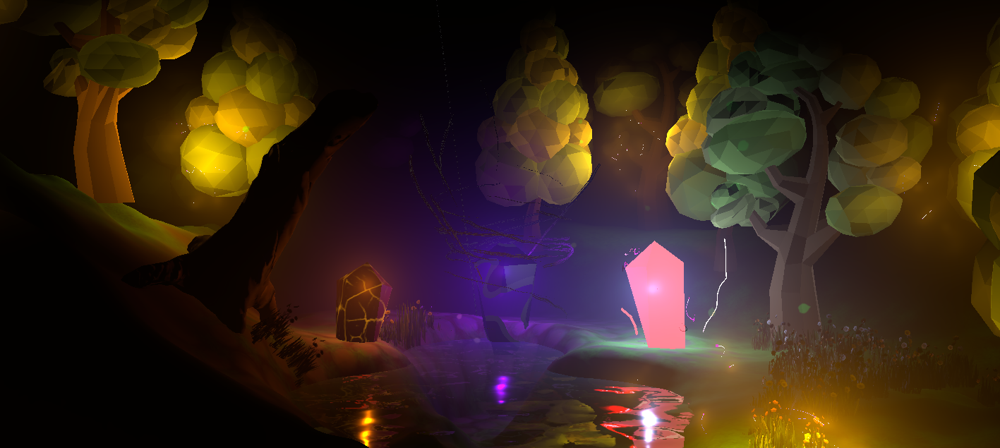

NOTE TO GRADERS: The final version of this project, and the one that should be graded, is on the "final" branch of this repo, NOT master
---
# mystical-grove
Game Graphics and Real Time Rendering Final Project

### Group Members:
- Aaron Kanehl - Fire Crystal, water crystal
- Evita Lobo - Clouds
- Kaio Barbosa - Water and terrain
- Wai Chun Leung - Tree and grass Sway
- Wesley Smith - Shadow Crystal, fireflies, day/night

### Objective:
As the final project of CMPM 163, we want to showcase a variety of interesting visual effects. We will create an aesthetically pleasing grove that will be the home to our VFX.
Each member will design a magical/elemental crystal that showcases an effect that they are fond of.

In our final scene, we aim to have the following effects implemented:
 - Vertex Displacement
 - Translucency
 - Caustics
 - Emission
 - Custom Lighting
 - Fog and Godrays
 
## To Run this project:
Use Unity version 19.1.4 to download and run this project. Or if you just want to see the end result, download the build from the 'Builds' folder and run the executable (Windows only).

### Extra files: 
There are extra files, including the documentation of the project and our intial presentation, both as PDF files saved in the 'MiscFiles' Folder. In addition to these two files, there is a video file (.mp4) that documents the scene, showing off some of the elements of the scene!
[Video Link](https://github.com/kaiobarb/mystical-grove/tree/master/MiscFiles) 

### Screenshots:

